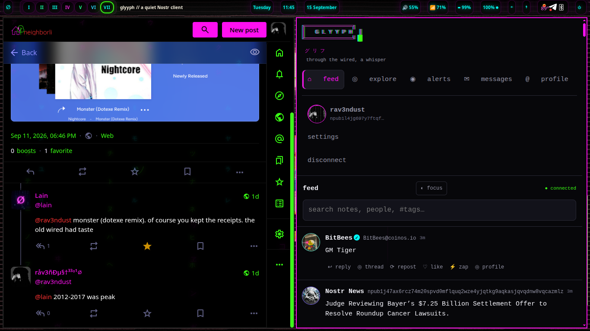
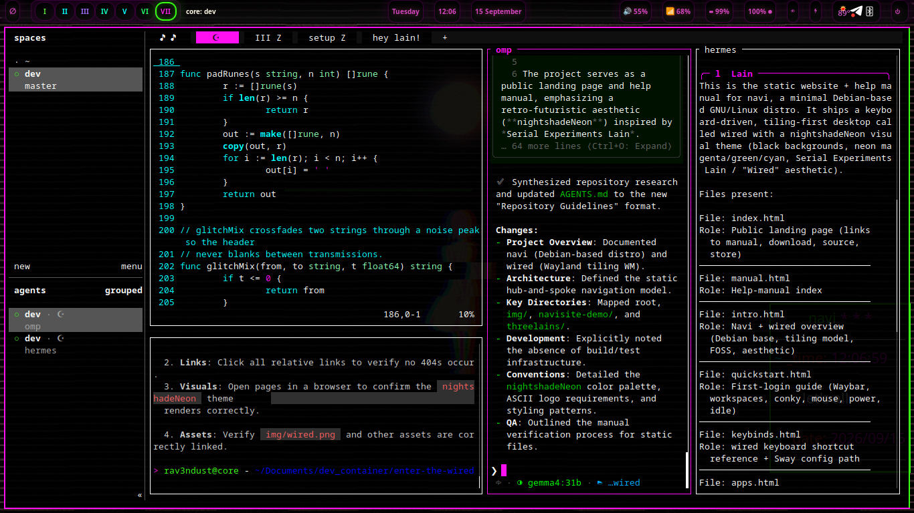
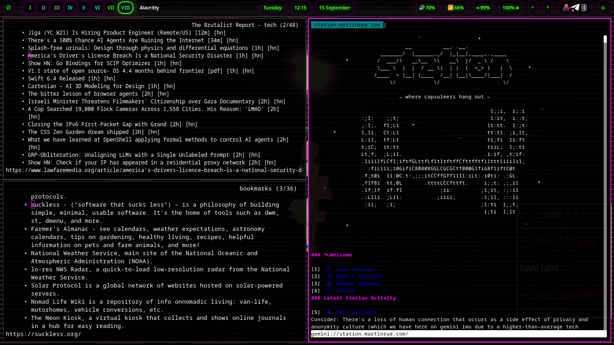
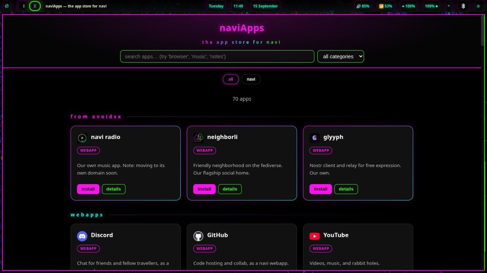
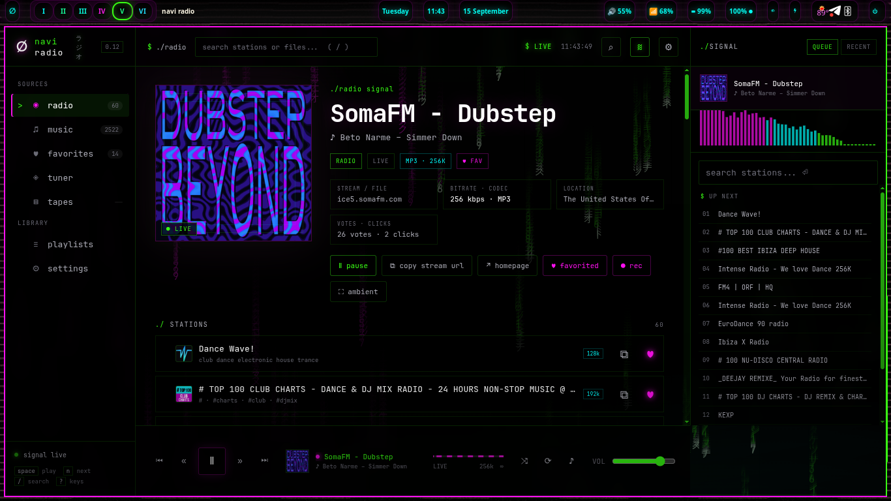
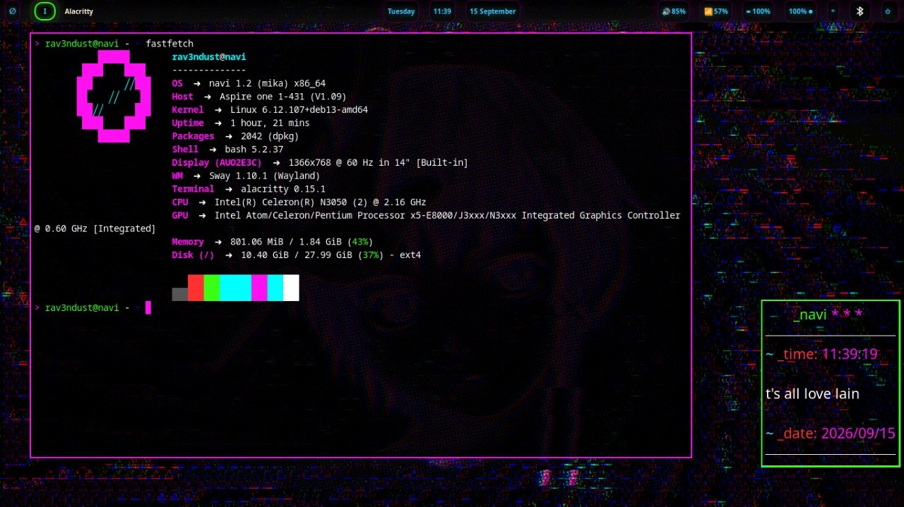

# navi

###### the minimal **navi** desktop

> **navi 1.2 "mika" is stable and available now.**
>
> Download it from the [Releases](https://github.com/xvoidsx/navi/releases/tag/v1.2-mika) page: `navi-1.2-mika.iso` plus `SHA256SUMS.txt` so you can verify your download. Boots on legacy BIOS and UEFI, x86_64.

**navi** is a new GNU/Linux distribution from your friends at [xvoidsx](https://github.com/xvoidsx).

It uses [wiredWM](https://github.com/rav3ndust/wiredWM), our fork of the `sway` wayland compositor, as its flagship desktop.

The compositor is heavily modified, and has an integrated `waybar`, `conky`, `rofi`, `dunst`, a host of custom scripts and curated software, and more.

It aims to celebrate the spirit of the Wired and provide a futuristic and yet retro-feeling computing environment that feels alive.

It's your window into the smallweb.

It follows the [Serial Experiments Lain](#) aesthetic, and also uses our [nightshadeNeon](https://rav3ndust.xyz/wiki/nightshadeNeon.html) theme all throughout the distro.

### cozy computing

**navi** brings you the minimalism and speed you can only get in a tiling environment, and it looks and feels great to live in. Here are some screenshots of it in day to day use.

A cozy computing environment is one that you look forward to using when you sit down at the computer. Not only does it feel good and functional to use, but it also looks beautiful as well! If you're going to be using your computer for hours every day doing work and play, don't you want to use a system that invites you to *have fun* while you do so?

###### tiled windows, agents at work

###### floating windows

###### browsing the web, and the smallweb

###### neighborli, one of **navi**'s built-in webapps

###### naviApps, the app store for **navi**

###### navi radio, tuned to the desktop

###### proven on old iron — **navi** 1.2 on a 2015 Acer Cloudbook

### notes

**navi 1.2 "mika"** is our first stable release. If you're new, grab the ISO from the [Releases](https://github.com/xvoidsx/navi/releases/tag/v1.2-mika) page and give it a spin in a VM or on a spare machine — it was validated on hardware as old as a 2015 Acer Cloudbook, so it'll run just about anywhere.

Documentation lives in the built-in manual: press `Super+Shift+H` anywhere in **navi** to open it, or browse the `wired/manual` folder in this repo.

Found a bug or have an idea? Open an issue in this repo's [issue tracker](https://github.com/xvoidsx/navi/issues) — that's where we track everything.

What's next: small maintenance releases on the 1.2 line, then **navi 2 "eiri"** — the coherence release.
