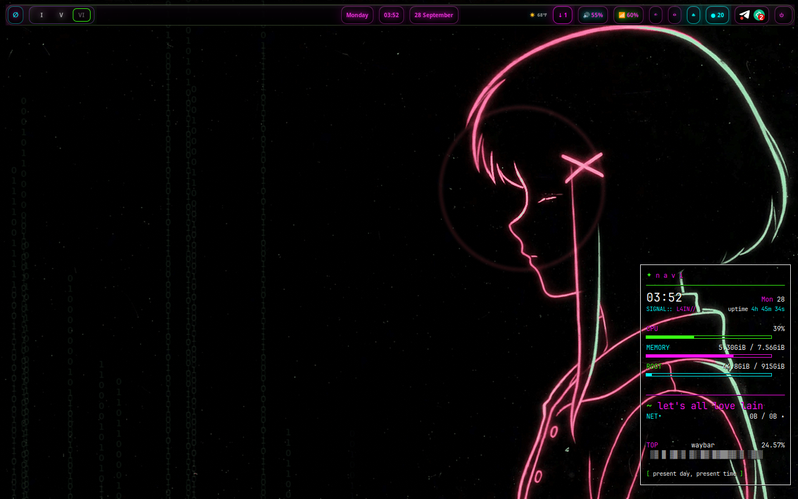
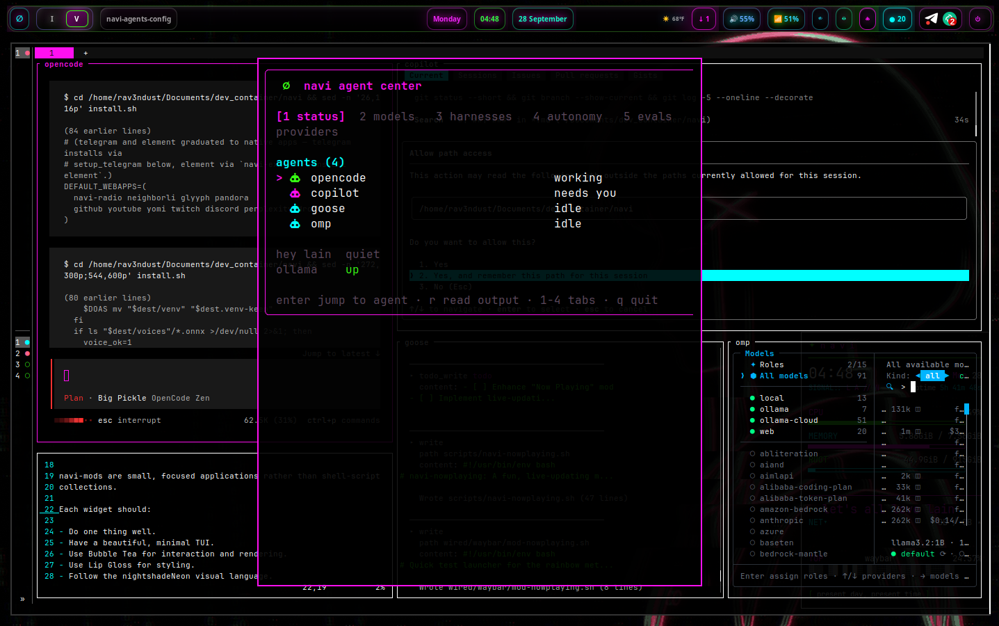
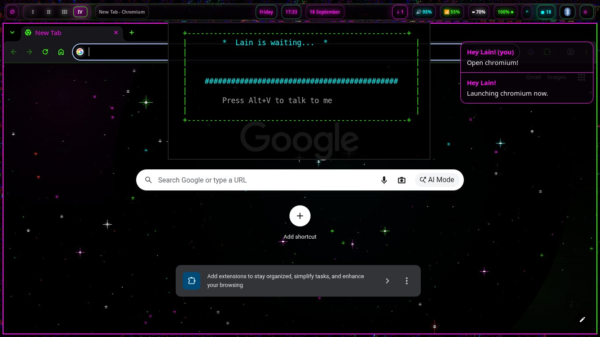
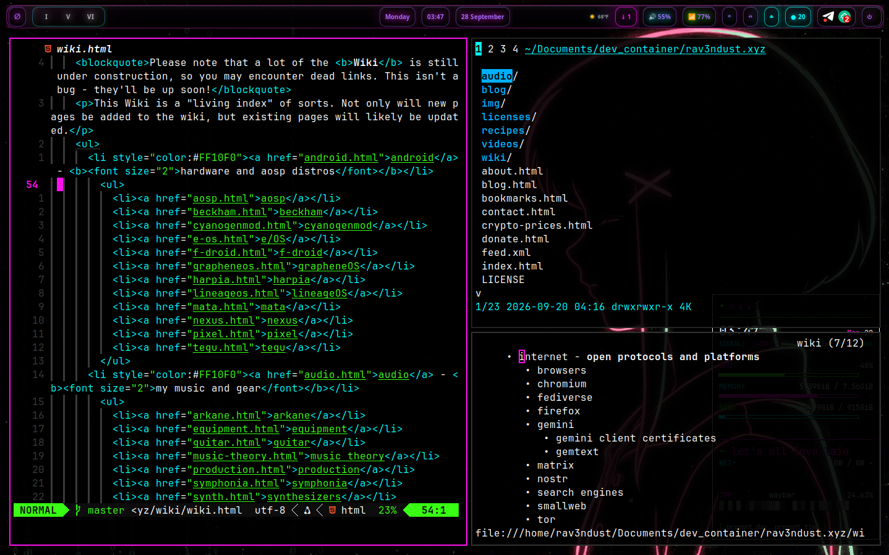
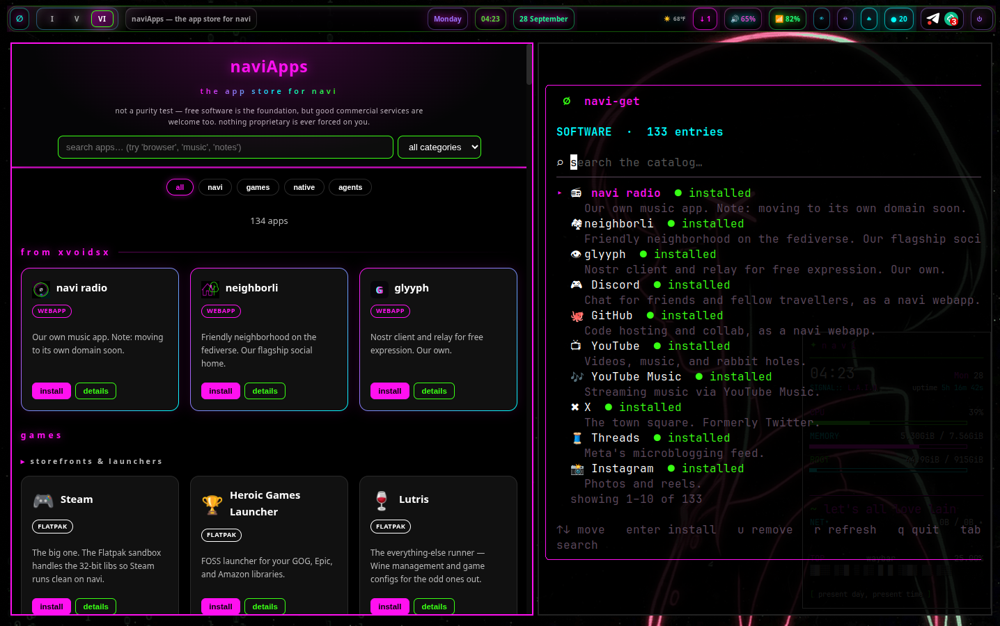
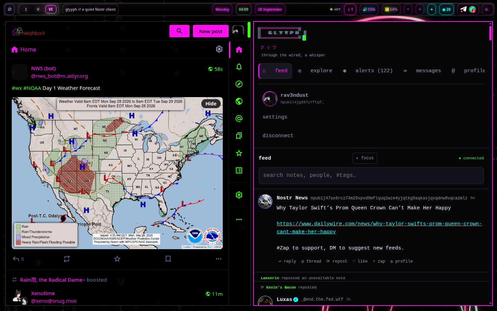
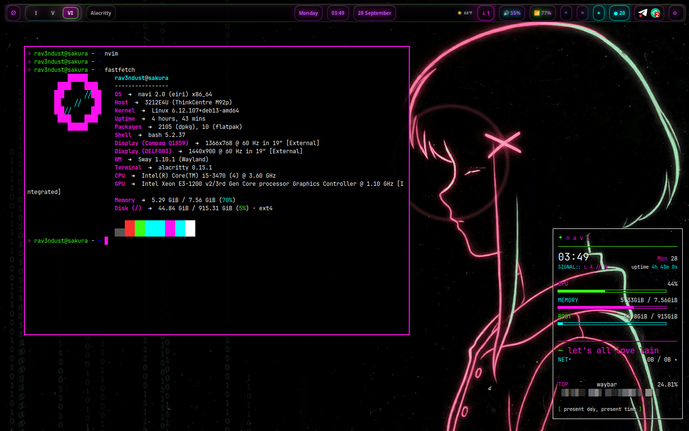

# navi

###### welcome to the wired

> **navi 1.6 "mika" is stable and available now** — the cohesion update.
>
> Download it from the [Releases](https://github.com/xvoidsx/navi/releases/latest) page. Boots on legacy BIOS and UEFI, x86_64.
>
> Feeling adventurous? The **eiri** rolling channel now publishes public snapshots: [github.com/xvoidsx/navi/releases/tag/eiri](https://github.com/xvoidsx/navi/releases/tag/eiri).

**⚠️Hi! This is navi's `tachibana` branch, and it is highly experimental.⚠️**

**This branch is for experimenting with a future re-base of navi to the nix way of doing things. Please don't use it for serious production work yet - stick with `mika` or `eiri`.**

**navi** is a GNU/Linux distribution from your friends at [xvoidsx](https://github.com/xvoidsx) — a complete, opinionated, **agent-native** desktop OS on a dependable Debian base.

It uses [wiredWM](https://github.com/rav3ndust/wiredWM), our fork of the `sway` Wayland compositor, as its flagship desktop (X11/i3 fallback included). Wayland-first tiling, deep blacks, neon pink, phosphor green — the **nightshadeNeon** design language across the whole desktop.

It aims to celebrate the spirit of the Wired and provide a futuristic and yet retro-feeling computing environment that feels alive.

It's your window into the smallweb.

### agent-native, out of the box

**navi** ships a full lineup of AI agents ready at a keypress — ollama, opencode, omp, goose, herdr — with a panel module that shows what they're doing and an agent center to manage them all.

###### the agent center — status, models, harnesses, autonomy, evals, providers

**Hey Lain** is navi's voice assistant: tap `Alt+V`, speak, and she runs desktop commands or chats through a small local language model. Your voice never leaves the machine.

###### Hey Lain — "press Alt+V to talk to me"

### cozy computing

**navi** brings you the minimalism and speed you can only get in a tiling environment, and it looks and feels great to live in.

###### the daily driver — tiling that stays out of your way

**Brave** is navi's default browser on the eiri channel — the most private Chromium out of the box, running navi's webapps too. Stock Chromium ships alongside it as the vanilla alternative, and `navi-browser` lets you switch the default anytime. The OS suggests, you decide.

**naviApps** is our nightshadeNeon app store — a curated catalog of 130+ apps: our own software, native apps, agents, and webapps. Not a purity test — good commercial services are welcome too, and nothing proprietary is ever forced on you.

###### naviApps — the app store for **navi**

Your people, your protocols: **neighborli** (our fediverse instance), **glyyph** (Nostr), and **navi radio** ship as webapps, alongside a terminal-native smallweb (elinks, amfora for Gemini).

###### your people, your protocols

### perma-computing

**navi** keeps old hardware useful. If the installer works on our 2015 Acer Aspire Cloudbook test bench, it'll work anywhere.

###### proven on old iron

### notes

**navi 1.6 "mika"** is the current stable release. If you're new, grab the ISO from the [Releases](https://github.com/xvoidsx/navi/releases/latest) page and give it a spin in a VM or on a spare machine.

**eiri** is the rolling channel — it tracks the latest development, and public snapshots publish at [github.com/xvoidsx/navi/releases/tag/eiri](https://github.com/xvoidsx/navi/releases/tag/eiri). That's where Brave-as-default is landing first.

Documentation lives in the built-in manual: press `Super+Shift+H` anywhere in **navi** to open it, or browse the `wired/manual` folder in this repo.

Found a bug or have an idea? Open an issue in this repo's [issue tracker](https://github.com/xvoidsx/navi/issues) — that's where we track everything.
